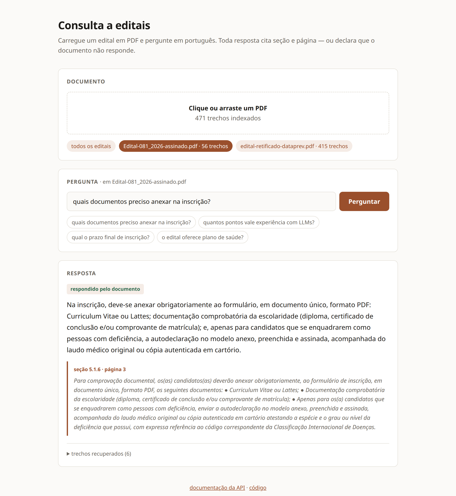
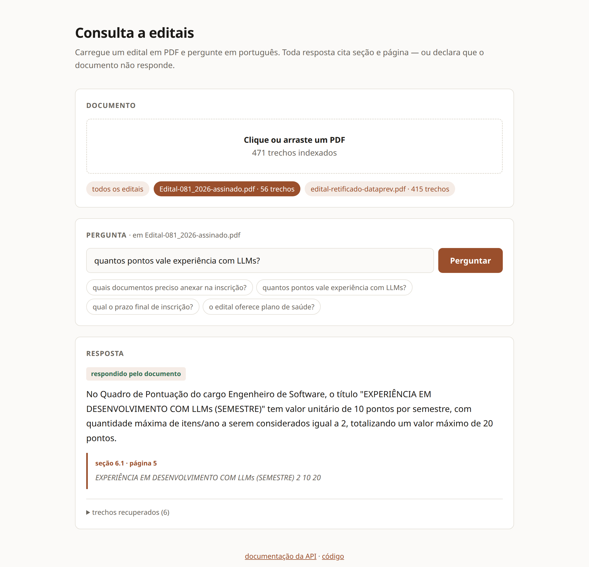
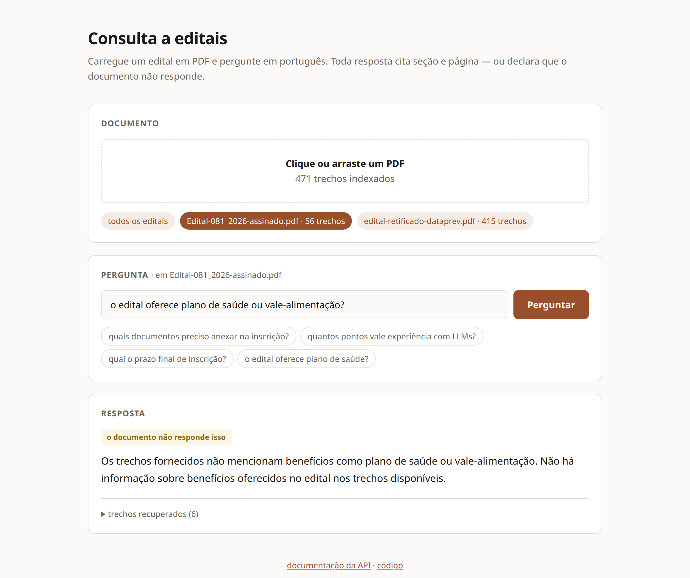

# edital-rag

Assistente de consulta a editais: pergunte em português sobre um edital em PDF e
receba a resposta **com citação de seção e página** — ou uma declaração explícita
de que o documento não responde aquilo.

```
$ make ask Q="qual o prazo final de inscrição?" DOC=Edital-081_2026-assinado.pdf

{
  "pergunta": "qual o prazo final de inscrição?",
  "resposta": {
    "encontrado": true,
    "resposta": "O prazo final de inscrição é 07/08/2026, conforme o cronograma da 1ª Etapa - Inscrições.",
    "citacoes": [
      {
        "secao": "8",
        "pagina": 6,
        "trecho": "1ª Etapa - Inscrições 27/07/2026 07/08/2026"
      }
    ]
  }
}
```

## A interface

Três consultas ao mesmo edital, na ordem em que respondem às três perguntas que
importam: a citação confere? acerta dentro de uma tabela? e o que ele faz quando
o documento simplesmente não responde?

**1. A citação é verificável** — a resposta aponta seção e página, e o trecho
citado vem junto para conferência.



**2. Tabela** — a pontuação está no Quadro III, uma tabela. É onde RAG de PDF
costuma devolver lixo, porque a extração embaralha as células.



**3. Recusa** — o edital não trata de benefícios. O sistema diz isso, em vez de
produzir uma resposta plausível e não verificável.



As telas são reproduzíveis: com a API no ar, `python3 scripts/capturar_demo.py`
gera as três a partir dos links diretos.

## Por que existe

Editais são documentos longos, com estrutura hierárquica densa, prazos
espalhados, tabelas de pontuação e — com frequência desconfortável —
contradições internas. Ler um inteiro para descobrir uma data leva 40 minutos.
Errar a leitura custa a vaga.

Um RAG genérico de documentos resolve isso mal, por uma razão específica: a
estratégia padrão de chunking destrói exatamente a estrutura que dá sentido ao
texto normativo. Este projeto ataca esse ponto.

## Como rodar

Requisitos: Docker e uma chave da API da Anthropic.

```bash
cp .env.example .env      # preencha ANTHROPIC_API_KEY
docker compose up --build
```

Abra **http://localhost:8000** — arraste o PDF, pergunte. Não há passo de build
de frontend: a interface é uma página única servida pelo próprio FastAPI, o que
mantém a promessa de um comando só.

Uma consulta feita fica no endereço, e o endereço reproduz a consulta:

```
http://localhost:8000/?doc=edital.pdf&q=qual+o+prazo+final+de+inscrição?
```

Abrir esse link já traz a resposta com a citação — é o que torna um resultado
compartilhável com quem precisa conferir a fonte.

Pela linha de comando, se preferir:

```bash
make ingest PDF=caminho/do/edital.pdf
make ask Q="quais documentos preciso anexar na inscrição?"
make ask Q="qual o prazo de inscrição?" DOC=edital.pdf   # restringe a um edital
```

O índice acumula editais. Com mais de um indexado, a busca sem `DOC` mistura
documentos no mesmo contexto — e como a numeração de seção se repete entre
editais, "seção 5.1, página 8" não diz de qual deles veio. A interface web
mostra um seletor assim que o segundo documento entra no índice.

Documentação interativa da API em `/docs`. Sem Docker: `make install && make dev`.

---

## Decisões de arquitetura

### 1. Chunking por hierarquia de seção, não por janela fixa

A abordagem padrão — quebrar a cada N caracteres com sobreposição — funciona
razoavelmente em prosa corrida e mal em documentos normativos. A unidade de
sentido de um edital é a **cláusula**, e ela é delimitada explicitamente pela
numeração.

Cortar no meio do item 5.1.6 produz dois fragmentos que individualmente não
respondem a nada. Pior: o recuperador devolve o pedaço com maior similaridade
lexical, que frequentemente é a metade sem a informação decisiva.

Aqui a quebra acontece onde o documento se quebra, e cada chunk carrega o caminho
dos ancestrais:

```
5. DA SELEÇÃO
  └── 5.1 Primeira Etapa - Inscrições + Análise Documental
        └── 5.1.6 Para comprovação documental, os candidatos deverão anexar...
```

Isso importa porque o texto de um item muitas vezes só faz sentido no contexto do
pai. O item 5.1.6 fala de documentos da **primeira** etapa — sem a hierarquia, a
resposta pode ser atribuída à etapa errada com total confiança.

**Onde a numeração acaba: os anexos.** Nenhum edital numera `ANEXO V` como `18`,
e o cronograma — que é o conteúdo mais perguntado de todos — vive lá. Sem um
padrão próprio para anexos, o Edital UFPE 12/2026 colava **31 páginas** (páginas
30 a 61: descrição de cargos, conteúdo programático, cronograma) como
continuação da última seção numerada, a 17.12.

O estrago é duplo e nenhuma metade levanta erro. O embedding de um chunk que
mistura lista de classificação com cronograma não aponta para nada, e a busca
vetorial deixa de alcançá-lo — na pergunta "qual o prazo final de inscrição?" o
cronograma não aparecia entre os 20 candidatos vetoriais e vinha em 19º no BM25,
longe do corte. E se fosse recuperado, citaria "seção 17.12, página 30" para um
conteúdo da página 59: uma citação verificável e errada, que é pior do que
nenhuma. Por isso `ANEXO <numeração>` também abre seção, e cada fragmento de uma
seção subdividida carrega a própria faixa de páginas em vez da página de
abertura.

### 2. Busca híbrida (vetorial + BM25), fundida por RRF

As duas buscas erram de formas complementares. A vetorial entende paráfrase
("quanto paga?" → "Remuneração Mensal Bruta") e é fraca em identificadores. A
lexical acerta códigos, siglas e números de item em cheio, e falha em qualquer
pergunta que não repita as palavras do documento.

Perguntas sobre editais costumam ter as duas naturezas na mesma frase.

A fusão usa **Reciprocal Rank Fusion** em vez de soma ponderada porque os scores
não são comparáveis: distância vetorial vive em `[0, 2]`, o BM25 do SQLite é uma
magnitude negativa sem limite. RRF usa apenas a posição no ranking, o que o torna
invariante à escala.

### 3. Citação obrigatória, imposta pelo schema

Alucinação em consulta a edital tem consequência real. Três mecanismos:

- **Structured outputs** (`output_config.format`) — a resposta é validada contra
  um JSON Schema. O campo `citacoes` existe por construção, não por o modelo
  lembrar de citar.
- **`encontrado: false`** — caminho explícito para "o edital não responde isso".
  Sem essa saída, um modelo pressionado a responder preenche a lacuna.
- **`trecho` literal** — cada citação carrega o texto copiado do documento, o que
  torna a verificação uma comparação de strings em vez de um ato de fé.

### 4. SQLite em vez de um vetorial dedicado

O índice inteiro é um arquivo. Sem serviço para subir, sem credencial extra, sem
container adicional no compose. Para dezenas de editais e alguns milhares de
chunks a busca é instantânea; trocar por Postgres/pgvector, Chroma ou Pinecone
seria otimizar um problema que este projeto não tem.

Três tabelas compartilhando `rowid`: `chunks` (dados), `vec_chunks`
(sqlite-vec, semântica), `fts_chunks` (FTS5, lexical).

### 5. fastembed em vez de sentence-transformers

Mesma qualidade para este modelo, imagem Docker de ~600MB em vez de ~2.5GB.
Quando um dos critérios de sucesso é "o avaliador consegue rodar com um comando",
o tamanho da imagem é requisito, não detalhe.

Modelo: `paraphrase-multilingual-MiniLM-L12-v2` (384 dim, ~220MB), escolhido por
desempenho em português — a maioria dos modelos pequenos é treinada só em inglês
e degrada bastante em PT-BR.

⚠️ **Prefixo é específico da família do modelo.** Modelos E5 exigem `query:` /
`passage:` e degradam sem eles; modelos `paraphrase-*` não usam prefixo, e
aplicá-los insere texto literal no embedding. Nos dois casos o erro é silencioso
— o sistema responde, só que pior. Por isso a decisão é derivada do nome do
modelo em vez de hardcoded: trocar `EDITAL_RAG_EMBEDDING_MODEL` não deve exigir
que alguém lembre de ajustar o prefixo junto.

### 6. Interface como página única, sem build

A tese do projeto é que `docker compose up` basta. Um passo de `npm install`
antes de a tela existir contradiria isso — e quem avalia um repositório
raramente executa o segundo passo.

Por isso a interface é um HTML único servido pelo FastAPI: sem bundler, sem
`node_modules`, sem dependência a mais no `pyproject.toml`. A API permanece
independente da UI, então trocar por um front em React depois não exige tocar
em nada do backend.

### 7. `effort: low` no modelo

A tarefa é sintetizar e citar um contexto **já recuperado**, não raciocinar do
zero. `low` responde bem, mais rápido e mais barato. Se as respostas saírem rasas
em perguntas que cruzam várias seções, o primeiro ajuste é subir para `medium` —
não trocar de modelo.

### 8. Filtro por documento dentro do k-NN, não depois dele

O índice guarda vários editais, e restringir a consulta a um deles parece um
`WHERE documento = ?` trivial. Não é, do lado vetorial: o `k` do sqlite-vec é
resolvido antes do JOIN, então filtrar depois seleciona os k vizinhos do índice
**inteiro** e descarta o que não for do documento pedido. Com 56 chunks de um
edital ao lado de 415 de outro, a busca filtrada no menor voltaria quase vazia —
e em silêncio, virando um "o edital não responde isso" indistinguível de uma
pergunta genuinamente sem resposta.

O filtro entra como `rowid IN (SELECT id FROM chunks WHERE documento = ?)`
dentro da própria cláusula do `MATCH`, que o sqlite-vec aplica **antes** de
escolher os vizinhos. No lado lexical não há sutileza: o `LIMIT` do FTS5 já vem
depois do `WHERE`.

---

## Custo operacional

Só uma etapa do pipeline chama API paga. As outras rodam localmente — e isso é
consequência direta das decisões 4 e 5, não coincidência.

| Etapa | Onde roda | Custo |
|---|---|---|
| Extração e chunking do PDF | local | — |
| Embeddings (`fastembed`/ONNX) | local | — |
| Busca vetorial + BM25 | SQLite local | — |
| **Geração da resposta** | **API da Anthropic** | **única cobrança** |

Indexar cem editais custa zero. Só perguntar custa.

### Estimativa por pergunta

Premissas: `top_k=6` (~2.000 tokens de contexto), instruções e schema (~500), e
saída de ~600 tokens somando resposta, citações e raciocínio em `effort: low`.

| Modelo | Entrada / Saída (US$/MTok) | Por pergunta | 200 perguntas |
|---|---|---|---|
| `claude-opus-5` | 5,00 / 25,00 | ~US$ 0,030 | ~US$ 6,00 |
| `claude-sonnet-5` | 3,00 / 15,00 | ~US$ 0,018 | ~US$ 3,60 |
| `claude-haiku-4-5` | 1,00 / 5,00 | ~US$ 0,006 | ~US$ 1,20 |

Desenvolver o projeto inteiro fica na casa de poucos dólares.

Trocar de modelo é uma variável de ambiente, sem tocar em código:

```bash
EDITAL_RAG_MODEL=claude-sonnet-5
```

### O que foi descartado

**Prompt caching** não se aplica aqui. O prefixo estável é só o par instruções +
schema (~500 tokens), abaixo do mínimo cacheável, e os chunks recuperados mudam
a cada pergunta — não há prefixo compartilhado para reaproveitar.

**Reduzir `top_k`** cortaria a maior parte do custo de entrada, mas é a alavanca
errada: recall pior é um problema de qualidade que custa mais caro que a
economia. Se o custo precisar cair, a ordem é modelo → `effort` → `top_k`.

---

## O que a validação contra um PDF real mudou

O chunker passou nos testes sintéticos de primeira e **falhou no primeiro edital
de verdade**. Três bugs, todos silenciosos — o sistema continuava respondendo,
só que pior:

| Sintoma | Causa | Correção |
|---|---|---|
| Cabeçalhos de seção não detectados; hierarquia vazia | `pdfplumber` com `x_tolerance` padrão (3) não insere espaço em negrito: `"2.1.2Requisitos:"`. O regex exigia `\s+` | `x_tolerance=2` na extração + espaço opcional no padrão |
| `"DOSCRITÉRIOS"` no índice | Mesma causa. Busca lexical por "critérios" nunca encontrava a seção 7 | idem |
| Seções fantasma `01`, `02`, `13`, `40` | `"40 horas (Trabalho híbrido)"` e `"13h00min às 17h00min"` casavam com o padrão | Detecção suspensa dentro de tabelas + rejeição de zero à esquerda + exigência de inicial maiúscula |

A guarda de maiúscula é a mais interessante: texto normativo **sempre** abre
cláusula com maiúscula, e falso positivo numérico **quase nunca**. Uma regra
resolve duas classes de erro.

Todos os três casos viraram teste de regressão.

---

## Duas hipóteses que a medição rejeitou

Expor o `trechos_usados` na resposta revelou um problema: para *"qual o prazo
final de inscrição?"*, o chunk correto vinha em **3º**, atrás de duas seções que
só falavam a palavra "prazo". Investigando, apareceu uma assimetria real — o
índice lexical recebia a hierarquia da seção e o vetorial não.

Duas correções pareciam óbvias:

1. **Incluir a hierarquia também no embedding.** Um item como "5.1.6 Para
   comprovação documental..." nunca diz "primeira etapa"; quem diz é o pai.
2. **Verbalizar tabelas.** `1ª Etapa | 27/07/2026 | 07/08/2026` tem quase nenhuma
   palavra de conteúdo. Reconstruir o par cabeçalho→valor daria a
   `"Data Final: 07/08/2026"` algo em que ancorar.

Ambas fazem sentido. Ambas pioraram o sistema.

```
configuração                 MRR   Recall@6
------------------------------------------
nenhuma (linha de base)    0.558      0.800  ←
só verbalização            0.544      0.800
só hierarquia              0.517      0.800
ambas                      0.436      0.800
```

Três achados:

- **A hierarquia dilui o vetor.** Prefixar `"5 DA SELEÇÃO › 5.1 Primeira Etapa"`
  num chunk pequeno faz o embedding apontar para o significado do cabeçalho em
  vez do conteúdo do item. Resgatou a seção 9.4, que sozinha não diz do que
  trata; derrubou três chunks que já eram específicos.
- **As duas juntas interagem negativamente.** Se os efeitos fossem
  independentes, o esperado seria ~0,50. Deu 0,436.
- **A assimetria era real, mas o remédio era o inverso.** O código original
  (lexical com hierarquia, vetorial sem) dava 0,513. Simetrizar melhorou para
  0,558 — **removendo dos dois lados**, não adicionando.

As duas continuam no código, atrás de `EDITAL_RAG_INDEXAR_HIERARQUIA` e
`EDITAL_RAG_VERBALIZAR_TABELAS`, desligadas por padrão. O efeito depende do
corpus: num acervo de documentos mais curtos, com seções mais ambíguas, a
hierarquia pode compensar. `make experimento` remede em dois minutos.

### O que isso revelou de mais importante

**`Recall@6` é 0,800 nas quatro configurações.** Nenhuma das mudanças alterou o
que é *encontrável* — só a ordem. Como o modelo recebe os 6 chunks de qualquer
forma, o impacto na resposta final é menor do que o MRR sugere.

O gargalo real está nas 3 perguntas que **nenhuma configuração recupera**, e duas
delas são sobre o cronograma: *"até quando posso me inscrever?"* e *"quando são
as entrevistas?"*. A seção 8 perde para a seção 5.2, que fala de entrevista o
tempo todo sem conter data nenhuma. É um problema de intenção da consulta — data
versus tópico — e nenhuma das duas hipóteses acima o tocava.

É onde eu trabalharia em seguida, e é o tipo de coisa que só fica visível depois
de existir a métrica.

## Testes

```bash
make test
```

50 testes, concentrados no chunking — é onde está a decisão de design e onde
estavam os bugs. Os casos de falso positivo (`"15.193 registros"`,
`"R$ 5.904,23"`, `"40 horas"`, `"Anexo I - REQUISITOS"` na lista de anexos do
próprio edital) são os mais importantes: seção fantasma contamina o índice sem
levantar nenhum erro.

Os cinco testes de `test_store_filtro.py` cobrem a outra falha silenciosa: o
filtro por documento medido num índice desequilibrado (50 chunks de um edital,
3 de outro), que é onde a implementação ingênua devolve zero resultados.

## Limitações conhecidas

- **PDF escaneado não funciona.** Não há OCR no pipeline; a ingestão falha com
  mensagem explícita em vez de indexar páginas vazias.
- **A detecção de seção assume numeração decimal** (`1`, `2.1`, `5.1.6`) ou
  cabeçalho de anexo (`ANEXO V`, `APÊNDICE II`). Editais numerados por artigo
  (`Art. 5º`) ou por romanos no corpo caem no caminho de fallback e viram um
  chunk único por documento.
- **Tabelas são serializadas como pipe-tables** e perdem células mescladas. O
  Quadro III do edital de teste sai legível, mas tabelas com hierarquia de
  cabeçalho aninhada ficam ambíguas.
- **Sem reranking.** Um cross-encoder sobre os top-20 melhoraria a precisão; foi
  deixado de fora por custo de latência e escopo.
- **A citação não nomeia o documento.** O schema da resposta tem seção e página,
  e a busca sem filtro pode cruzar editais — só a tabela de trechos recuperados
  mostra a origem. Perguntar com o documento escolhido resolve na prática, mas o
  caminho certo é o nome do arquivo entrar no contexto do modelo e na citação.
- **O gabarito tem 15 perguntas e um documento.** `make eval` mede o suficiente
  para pegar regressão estrutural, não para afirmar qualidade absoluta. O
  harness é restrito ao documento do gabarito (`DOCUMENTO`, em
  `scripts/avaliar_retrieval.py`) — sem isso a métrica mente, porque a numeração
  de seção se repete entre editais e um chunk "8" de outro documento indexado
  conta como acerto.
- **Recall@6 estacionado em 0,800.** Três perguntas do gabarito não são
  recuperadas em nenhuma configuração testada; duas são sobre o cronograma do
  Edital 081, que é uma **tabela dentro de seção numerada** — caso diferente do
  cronograma em anexo, que o chunker passou a tratar.
- **O índice está acoplado à versão do `fastembed`.** Um upgrade que mude a
  estratégia de pooling do modelo exige reindexar tudo — indexar com uma versão
  e consultar com outra degrada em silêncio.

## Stack

Python 3.12 · FastAPI · Poetry · Docker · SQLite + sqlite-vec + FTS5 ·
fastembed (ONNX) · pdfplumber · API da Anthropic (Claude) · pytest

## Licença

MIT
